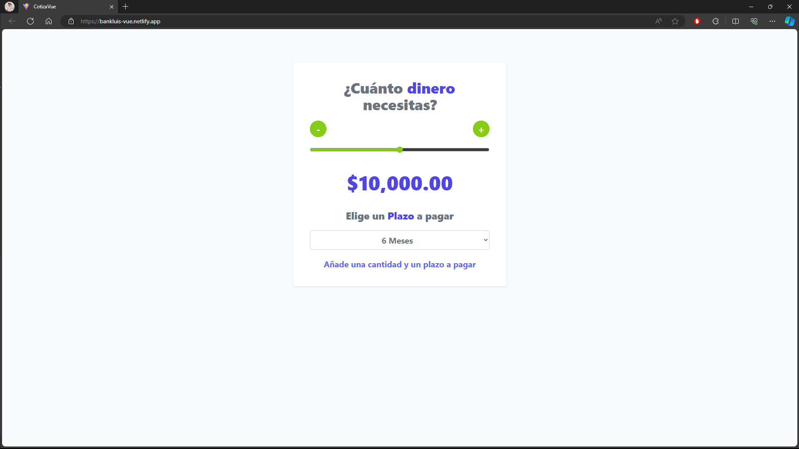

# CotizaPréstamosVue

## Demo

[Enlace a la Demo](https://bankluis-vue.netlify.app/)

## Descripción

CotizaPréstamosVue es una aplicación simple que te permite calcular el monto total y las mensualidades de un préstamo basándose en la cantidad solicitada y el plazo seleccionado. La aplicación está construida con Vue 3 y utiliza Vite para la parte visual.

## Características

- Ajusta la cantidad y el plazo para obtener una cotización instantánea.
- Visualiza el monto total a pagar y las mensualidades.
- Diseño limpio y fácil de usar.

## Tecnologías Utilizadas

- Vue 3
- Vite
- Tailwind CSS

## Instalación

1. Clona este repositorio: `git clone https://github.com/LuisMariscalDev/CotizaPrestamosVue.git`
2. Instala las dependencias: `npm install`
3. Ejecuta la aplicación: `npm run dev`

## Uso

1. Abre la aplicación en tu navegador.
2. Ajusta la cantidad y el plazo usando los controles deslizantes y el menú desplegable.
3. Observa cómo se actualiza instantáneamente la información sobre el préstamo.

## Licencia

Este proyecto está bajo la Licencia MIT.

## Autor

LuisMariscalDev